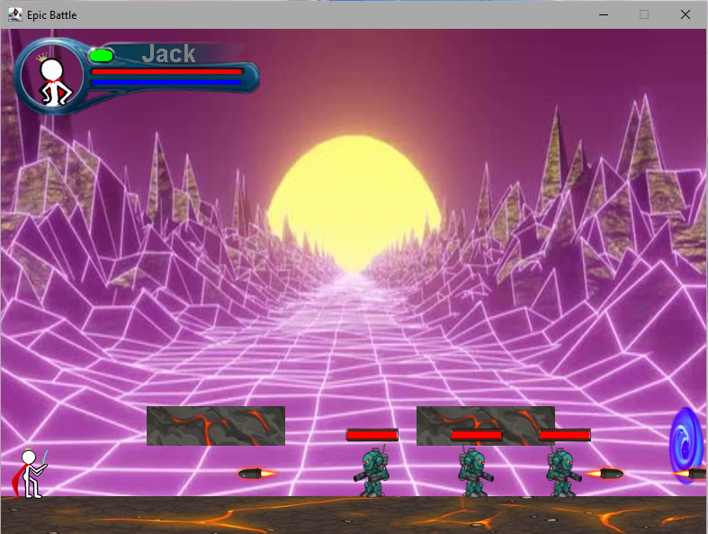

## Epic Battle
A 2D RPG(role-playing video game) game. Control your hero to fight monsters!

Language, framework, class used: 

<p>


</p>

Game overview:



## Getting Started

Download the project, then go to BattleDriver.java and run it.

## Folder Structure

```
.
│  BattleDriver.java       Game driver
│
├─character                Characters
│      Character.java      Character abstract methods extends by Enemy and Hero
│      Enemy.java          Enemy properties, action
│      Hero.java           Hero properties, control, motion, collision detection
│
├─frame                    Game frame setup
│      Background.java     Background and enemies setup
│      GameFrame.java      GUI, grame drawing, effects drawing
│      Obstacle.java       Obstacles loaction, size setup
│      StaticValue.java    Image pre-import, cache loading
│
├─images                   Images materials
│    
├─music                    Music material and loading
│      Music.java          Music loading
│      music.mp3           Music material
│
└─weapon                   Weapon definition
        Armory.java        Weapon Enum class used by Hero, GameFrame
        Bullet.java        Bullet generation and motion control
        Magic.java         Magic weapon properties and attack detection
        Melee.java         Melee weapon properties and attack detection
        Ranged.java        Ranged weapon properties and attack detection
        Weapon.java        Interface of weapons implemented by Melee, Ranged, Magic
```

- `src`: the folder to maintain sources
- `lib`: the folder to maintain dependencies
- `bin`: the folder to maintain compiled output files

## Dependency

jaco-mp3-player-0.9.3.jar
More detials can be found [here](http://jacomp3player.sourceforge.net/guide/javadocs/jaco/mp3/player/MP3Player.html).

